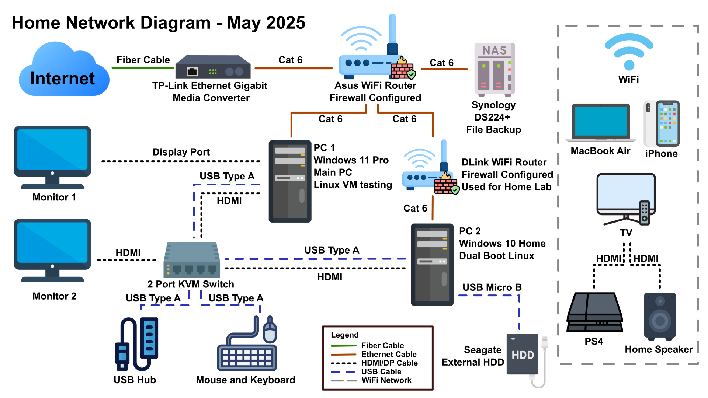

📘 [English](README.md) | 📙 [中文](README_zh.md)

# 🏠 Home Network Diagram – June 2025

This diagram outlines my current home network and workstation setup. My goal is to simulate a small office/home office (SOHO) environment and create a home lab environment for testing, monitoring, and managing various system administration tasks.

## 🧑‍💻 Network Overview

My home network consists of both wired and wireless components. The network is managed through an ASUS Wi-Fi router with firewall enabled. The Asus router receives its uplink from a TP-Link Ethernet Gigabit Media Converter (ISP-provided), which is connected to a fiber network. A secondary D-Link Wi-Fi Router is configured and segmented for home lab use, enhancing security and enabling testing in an isolated environment.

### 🔌 Wired Infrastructure
- **PC 1 – Windows 11 Pro**  
  Primary admin workstation for daily operations, system configuration, and running Linux VMs (e.g., Ubuntu Server, CentOS 9) for testing.
- **PC 2 – Windows 10 Home (Dual Boot Linux)**  
  Connected to the secondary router (D-Link), used as a lab machine for Linux testing, OS configuration, and cross-segment communication experiments.
- **Synology DS224+ NAS**  
  Configured for file backup, data redundancy, and centralized storage management using SMB/AFP protocols.

### 🖥️ Peripheral and Display Management
- **2-Port KVM Switch**  
  Manages keyboard, mouse, and dual-display setup between both PCs.
  Using the KVM switch allows me to switch between PCs while I practice and test my home lab environment. 
- **USB Hub, External HDD (Seagate)**  
  For expanded I/O to support backup operations and file organizations.

### 🛜 Wireless Devices 
- **MacBook Air, iPhone**  
  Primarily used as personal devices, but available for occasional testing of connectivity, VPN access, and remote file syncing across non-Windows platforms.
- **Smart TV, Speaker, PS4**  
  Consumer devices connected to the network for daily use. While they are not part of the lab environment, they can be referenced for basic network visibility, segmentation, or bandwidth management if needed.

## 🔐 Network Services & Security
- **ASUS Router (Primary)** – Configured with SPI/NAT firewall and DHCP enabled
- **D-Link Router (Secondary)** – Lab-isolated with its own firewall
- **DHCP Server** – Internal IP distribution
- **Static IP Mapping** – Reserved IP for NAS and lab VMs
- **VM Testing** – Linux VMs launched via VirtualBox for patch testing, automation scripts, and basic network segmentation trials
---

### Conclusion

My goal for setting up this network is to practice core system administration skills. This includes network design with segmented routers, cross-platform system provisioning, firewall and DHCP configuration on consumer-grade hardware, shared resource management using a NAS and KVM switch, and peripheral integration. The environment supports lab testing through isolated network segments and VM deployment, enabling patch testing, basic service hosting (e.g., SMB), and system hardening. These configurations help me better understand networking fundamentals and expand my knowledge by simulating real-world administrative responsibilities in a secure and organized environment.

